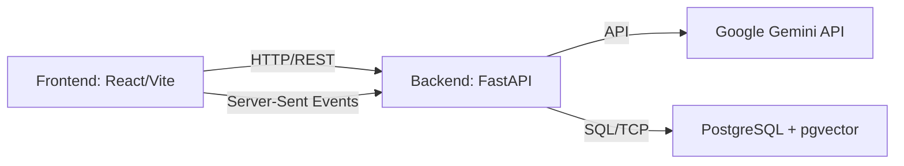

# สถาปัตยกรรมระบบ (System Architecture)

เอกสารนี้อธิบายโครงสร้างและการทำงานของ **RAG Chatbot Workshop** ซึ่งเป็นแอปพลิเคชันที่รวบรวมเทคโนโลยี Document RAG, SQL RAG และ Agentic Routing เข้าด้วยกัน

---

## 1. โครงสร้างระบบโดยรวม (Overview)

ระบบทำงานแบบ Client-Server Architecture โดยแบ่งออกเป็น 3 ส่วนหลัก:

1. **Frontend (React + Vite + Tailwind CSS)**:
   - ส่วนติดต่อผู้ใช้ (UI) สำหรับแชทและอัปโหลดไฟล์
   - จัดการ State ของการสนทนา, การเลือกโหมด (Auto/RAG/SQL), และแสดงผลเนื้อหาแบบ Streaming (SSE)
2. **Backend (Python + FastAPI)**:
   - เป็นตัวกลางรับ request จากผู้ใช้ ประมวลผลตรรกะของ RAG / Agentic Flow
   - เชื่อมต่อกับฐานข้อมูลเพื่อค้นหาข้อมูลและจัดการไฟล์
   - เรียกใช้ LLM (Google Gemini) สำหรับการประมวลผลข้อความและการแปลงเป็น SQL
3. **Database (PostgreSQL + pgvector)**:
   - ทำหน้าที่เป็นทั้ง Relational Database ปกติ และ Vector Database สำหรับเก็บและค้นหา Embeddings

---

## 2. ระบบ RAG (Retrieval-Augmented Generation)

ระบบนี้รองรับ RAG สองรูปแบบและการทำงานแบบ Agentic:

### 2.1 Document RAG (โหมด `rag`)
การถาม-ตอบจากเอกสาร (PDF, TXT, CSV, MD)
- **Ingestion (ขาเข้า)**:
  1. ไฟล์ถูกอัปโหลดผ่าน API `/ingest/file`
  2. ทำการสกัดข้อความ (Text Extraction) เช่น ใช้ `pypdf` สำหรับไฟล์ PDF
  3. สับข้อความเป็นชิ้นย่อย (Chunking) โดยกำหนดขนาด (Chunk Size) และส่วนเหลื่อม (Overlap) เพื่อรักษาบริบท
  4. แปลงข้อความเป็นเวกเตอร์ (Embedding) โดยใช้โมเดล `gemini-embedding-001`
  5. บันทึกข้อความและเวกเตอร์ลงในตาราง `doc_chunks`
- **Retrieval (ขาออก)**:
  1. แปลงคำถามของผู้ใช้เป็นเวกเตอร์
  2. ใช้ Cosine Similarity ค้นหาชิ้นส่วนข้อความ (Chunks) ที่มีความหมายใกล้เคียงกับคำถามมากที่สุด (Top K) จากฐานข้อมูล
  3. นำข้อมูลที่ได้ (Context) ส่งไปพร้อมกับคำถามให้ LLM เพื่อสร้างคำตอบ

### 2.2 SQL RAG (โหมด `sql`)
การถาม-ตอบจากฐานข้อมูลแบบมีโครงสร้าง
- ใช้เทคนิค **Function Calling / Tool Use** ของโมเดล Gemini (`gemini-2.5-flash`)
- เมื่อผู้ใช้ถามคำถามเกี่ยวกับข้อมูล (เช่น "ยอดขายเดือนมกราคมเท่าไร") ระบบจะส่ง Schema ของฐานข้อมูลให้ LLM
- LLM สร้างคำสั่ง SQL กลับมาให้ระบบ
- Backend นำ SQL ไปรันบนฐานข้อมูลจริง (ในโหมด Read-only เพื่อความปลอดภัย)
- นำผลลัพธ์ที่ได้จากฐานข้อมูล ส่งกลับไปให้ LLM เพื่อเรียบเรียงเป็นคำตอบภาษามนุษย์

### 2.3 Agentic RAG (โหมด `auto`)
ระบบอัจฉริยะที่สามารถเลือกวิธีการตอบคำถามได้เองผ่าน State Graph
1. **Routing**: วิเคราะห์ความตั้งใจของผู้ใช้ว่าควรถามเอกสาร (Docs) หรือควรถามฐานข้อมูล (SQL)
2. **Evaluation**: ประเมินคุณภาพของข้อมูลที่ดึงมา (Context) ว่า "ตรงประเด็น (Relevance)" และ "เพียงพอ (Sufficiency)" หรือไม่
3. **Query Rewriting**: หากข้อมูลไม่เพียงพอ ระบบจะปรับแต่งคำถาม (Rewrite Query) ให้ชัดเจนขึ้นและค้นหาใหม่โดยอัตโนมัติ (ทำซ้ำสูงสุด 2 รอบ)

---

## 3. ฐานข้อมูล (Database)

ใช้ **PostgreSQL 16** พร้อมลงส่วนเสริม (Extension) **pgvector**

มีตารางสำคัญสองส่วน:

### 3.1 ตารางสำหรับระบบ Vector Search (Document RAG)
- `doc_chunks`: เก็บข้อมูลชิ้นส่วนเอกสารและเวกเตอร์
  - `chunk_id` (UUID): รหัสอ้างอิงชิ้นส่วนเอกสาร
  - `doc_id` (VARCHAR): ชื่ออ้างอิงของเอกสาร
  - `chunk_index` (INT): ลำดับชิ้นส่วน
  - `content` (TEXT): เนื้อหาข้อความในชิ้นส่วนนั้น
  - `embedding` (VECTOR): ตัวเลขเวกเตอร์ที่ได้จาก Embedding Model (มิติขนาด 768 ตามโมเดลที่ใช้)
  - `metadata` (JSONB): ข้อมูลประกอบอื่นๆ เช่น ชื่อไฟล์ต้นฉบับ

### 3.2 ตารางข้อมูลธุรกิจ (SQL RAG)
สำหรับเวิร์กช็อปนี้มีตารางตัวอย่าง (อ้างอิงจาก `sql/schema.sql`):
- `customers` (ข้อมูลลูกค้า)
- `products` (ข้อมูลสินค้า)
- `sales` (ข้อมูลรายการขาย)

---

## 4. API Endpoints (FastAPI)

API รันอยู่บนพอร์ต `8000` โดยมี Endpoints หลักดังนี้:

### 4.1 Chat API
- `POST /chat`
  - การพูดคุยแบบรอผลลัพธ์ทีเดียวรวด (Synchronous)
  - รับ Request Body: `{"message": "คำถาม", "mode": "auto|rag|sql", "top_k": 5}`
- `POST /chat/stream`
  - การพูดคุยแบบสตรีมมิ่ง พิมพ์คำตอบทีละคำ (Server-Sent Events)
  - Payload เดียวกับ `/chat`

### 4.2 Ingestion & Document Management
- `POST /ingest/file`
  - อัปโหลดไฟล์เพื่อทำ RAG
  - รับข้อมูลแบบ `multipart/form-data`: `file`, `doc_id`, `chunk_size`, `overlap`
  - *บันทึกไฟล์ต้นฉบับไว้ใน Directory สำหรับให้ดาวน์โหลดภายหลัง*
- `POST /ingest`
  - สร้าง RAG จากข้อความ (Text string) โดยตรง
- `GET /documents`
  - ดึงรายชื่อเอกสารทั้งหมดในระบบ พร้อมจำนวน chunks ของแต่ละเอกสาร
- `GET /documents/{doc_id}/content`
  - ดึงข้อมูล chunks ทั้งหมดและเนื้อหาแบบเต็มของเอกสารที่ระบุ
- `GET /documents/{doc_id}/file`
  - ดาวน์โหลดไฟล์ต้นฉบับที่เคยอัปโหลดไว้ (ถ้ามี)
- `DELETE /documents/{doc_id}`
  - ลบเอกสารและข้อมูลเวกเตอร์ออกจากฐานข้อมูล

### 4.3 System
- `GET /health`
  - ตรวจสอบสถานะการทำงานของระบบและการเชื่อมต่อฐานข้อมูล
